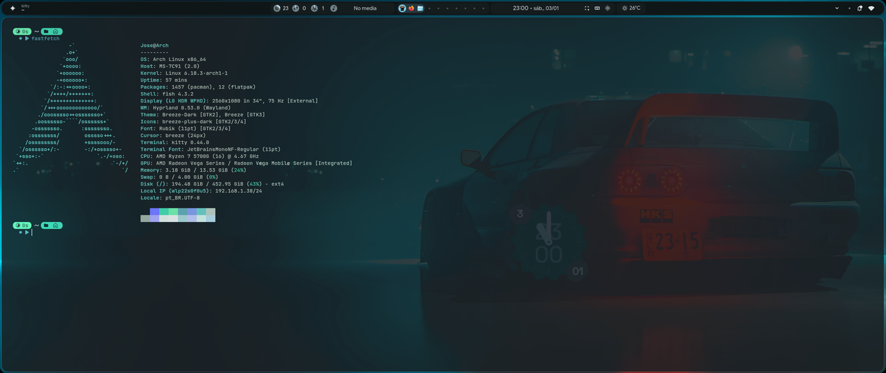

# My Personal Arch + Hyprland Dotfiles

## Showcase

  
   
  <em> Setup</em>

---

## Disclaimer

> **Note:** This repository is a personal fork/customization based on the **End-4 Dotfiles**.
>
> If you want to install this configuration from scratch, I **strongly recommend** using the installation script from the original repository first. My repository contains personal hardcoded paths and specific hardware configurations (monitors) that might break your system if applied directly.

* **Original Repository:** [end-4/dots-hyprland](https://github.com/end-4/dots-hyprland)

## Credits

* **Base Configuration:** [end-4](https://github.com/end-4/dots-hyprland)
* **Window Manager:** [Hyprland](https://github.com/hyprwm/Hyprland)
* **Terminal:** [Kitty](https://sw.kovidgoyal.net/kitty/)
